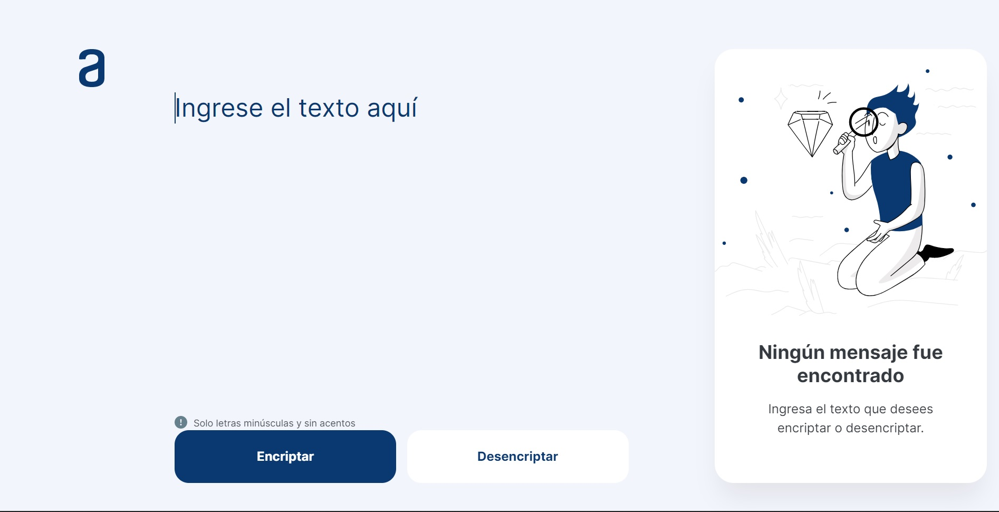

# Oracle One - Encryptor

  
  
  

## Descripción

Este es un simple encriptador hecho con HTML, CSS y JavaScript, el cual encripta y desencripta un texto ingresado por el usuario. El encriptado se realiza mediante el reemplazo de vocales a una palabra específica definida por un diccionario determinado.

El encriptado solo se puede realizar para palabras minúsculas sin caracteres especiales. La página cuenta con un formulario para encriptar y desencriptar el texto ingresado además de tener un botón de copiar.

## Diccionario

# Encriptado

| Llave | Valor |
|-----------|-----------|
| a | ai |
| e | enter |
| i | imes |
| o | ober |
| u | ufat |

# Desencriptado

| Llave | Valor |
|-----------|-----------|
| ai | a |
| enter | e |
| imes | i |
| ober | o |
| ufat | u |

### Ejemplo

"gato" -> "gaitober"
"gaitober" -> "gato"

## Requisitos

- Debe funcionar solo con letras minúsculas
- No deben ser utilizados letras con acentos ni caracteres especiales
- Debe ser posible convertir una palabra para la versión encriptada también devolver una palabra encriptada para su versión original.
- La página debe tener campos para
inserción del texto que será encriptado o desencriptado, y el usuario debe poder escoger entre as dos opciones.
- El resultado debe ser mostrado en la pantalla.

### Opcional

Un botón que copie el texto encriptado/desencriptado para la sección de transferencia, o sea que tenga la misma funcionalidad del ctrl+C o de la opción "copiar" del menú de las aplicaciones.